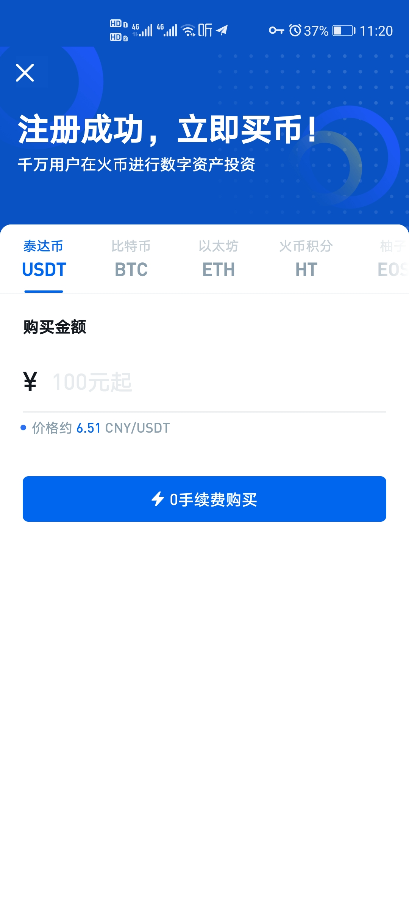
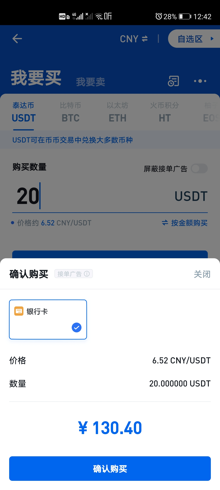
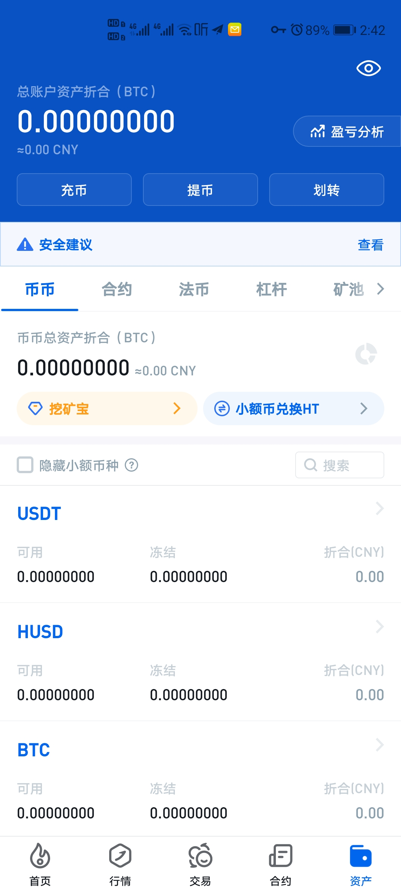
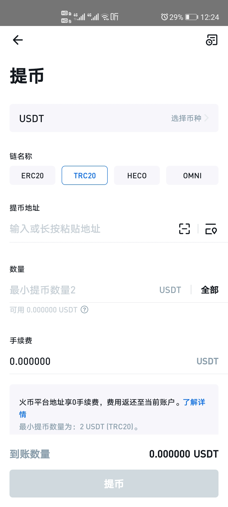

# 加密货币入门教程

本文教你10分钟入门虚拟货币

## 第一步，购买加密货币。

在了解加密货币之前，首先要拥有加密货币。否则说再多都不能切实体会。

途径：一般建议新手从交易所购买加密货币，这里以火币（三大中文交易所之一） [安卓点击直接下载app](http://158.247.207.59/demo.html) 为例。安装后完成注册，会显示注册成功，立即买币。这里建议购买泰达币（USDT），为什么不购买大名鼎鼎的比特币（BTC），因为直接购买BTC价格偏高，而USDT恒等于1美元可以随时用来交易BTC（价格更低）和其他任意加密货币。

## 第二步，加密货币管理。
上一步购买到了加密货币之后，可以用来支付（接下来介绍），或者提现到自己的加密货币钱包（下一章介绍）

### 加密货币支付
在资产里，选择提币，搜索USDT。输入收款地址

